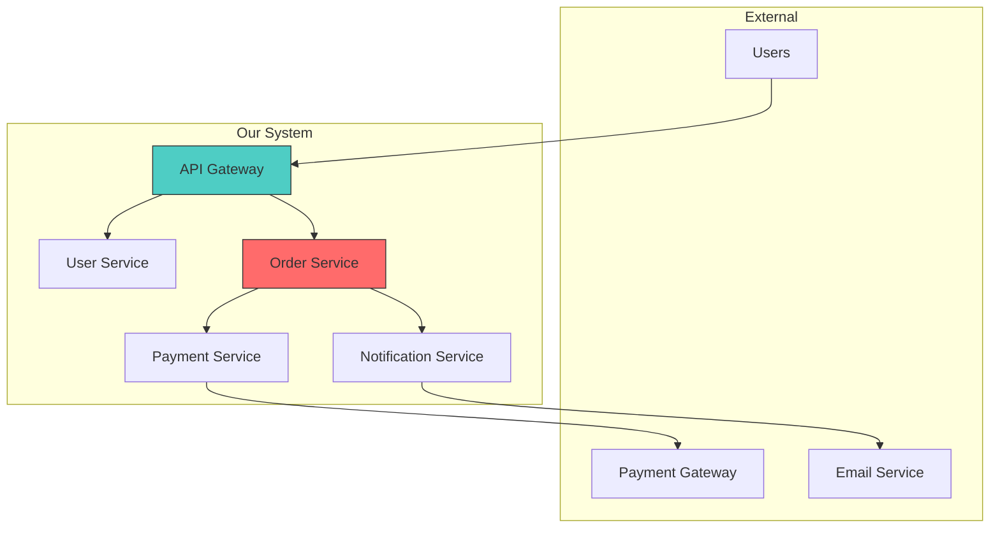
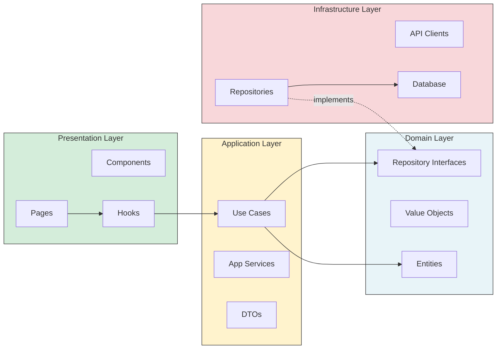

# Canvas Integration

Request visualizations from Canvas agent for architecture documentation.

## System Context Diagram

```markdown
## CANVAS_REQUEST

### Diagram Type: System Context (C4 Level 1)
### Purpose: Show system boundaries and external actors

### System
- Name: [System Name]
- Description: [What it does]

### External Actors
- Users: [Web App Users, Mobile App Users]
- External Systems: [Payment Gateway, Email Service, Analytics]

### Relationships
- User → System: Uses via web browser
- System → Payment Gateway: Processes payments
- System → Email Service: Sends notifications
```

## Component Diagram

```markdown
## CANVAS_REQUEST

### Diagram Type: Component Diagram (C4 Level 3)
### Purpose: Show internal components and dependencies

### Components
1. API Gateway - Entry point, auth, rate limiting
2. User Service - User management, authentication
3. Order Service - Order processing, status management
4. Payment Service - Payment processing, refunds
5. Notification Service - Email, push notifications

### Dependencies
- API Gateway → [User Service, Order Service]
- Order Service → [Payment Service, Notification Service]
- Payment Service → External Payment Gateway
```

## Dependency Graph

```markdown
## CANVAS_REQUEST

### Diagram Type: Dependency Graph
### Purpose: Visualize module dependencies and identify issues

### Modules
- @app/auth → [@app/shared, @app/api]
- @app/orders → [@app/auth, @app/products, @app/shared]
- @app/products → [@app/shared]
- @app/shared → (no dependencies)

### Issues to Highlight
- Circular: @app/orders ↔ @app/products (if exists)
- God module: @app/shared (too many dependents)
```

## Migration Roadmap

```markdown
## CANVAS_REQUEST

### Diagram Type: Timeline / Gantt
### Purpose: Show migration phases and milestones

### Phases
1. Phase 1 (Week 1-2): Setup new structure
2. Phase 2 (Week 3-4): Migrate auth module
3. Phase 3 (Week 5-6): Migrate orders module
4. Phase 4 (Week 7-8): Cleanup and validation

### Milestones
- M1: New folder structure created
- M2: Auth module migrated, old code deprecated
- M3: All modules migrated
- M4: Old code removed, migration complete
```

---

## Mermaid Examples for Self-Generation

### Architecture Overview



### Module Dependencies


