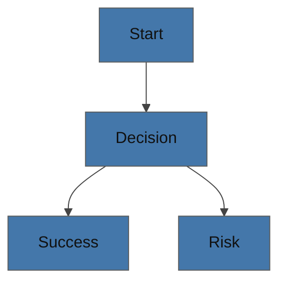

# Canvas Accessibility Reference

Purpose: Read this when the diagram must remain understandable for color-vision deficiency, screen-reader use, or plain-text fallback.

## Contents

- CVD-safe palette
- Shape and pattern differentiation
- Alt text rules
- ASCII fallback triggers
- Accessibility checklist

## CVD-Safe Palette

| Role | Hex | Notes |
|------|-----|-------|
| Blue | `#4477AA` | Safe primary line or highlight |
| Teal | `#228833` | Positive / success |
| Yellow | `#CCBB44` | Caution / neutral |
| Coral | `#EE6677` | Risk / error |
| Cyan | `#66CCEE` | Secondary emphasis |
| Gray | `#BBBBBB` | Neutral or de-emphasis |
| Purple | `#AA3377` | Accent |
| Light Blue | `#99DDFF` | Soft highlight |

## Why This Matters

| Condition | Approx. prevalence | Design implication |
|-----------|--------------------|--------------------|
| Protanopia | `~1%` | Avoid red-only meaning |
| Deuteranopia | `~1%` | Avoid green-only meaning |
| Tritanopia | `~0.01%` | Avoid blue-yellow-only meaning |
| Achromatopsia | `~0.003%` | Use labels, line style, and shape, not color alone |

## Rules

- Never encode meaning with color only.
- Pair color with labels, icons, line style, or node shape.
- Keep contrast strong enough for typical documentation viewing.
- Use ASCII fallback if the environment cannot reliably render color or shape.

## Mermaid Starter

## draw.io Style Hints

- Use high-contrast stroke colors.
- Use dashed vs solid edges for semantic differences.
- Use shape differences for success, warning, and critical states.
- Do not use pale fill as the only severity signal.

## Alt Text Formula

Use one short paragraph:

1. Purpose: what question the diagram answers
2. Structure: major sections or flows
3. Highlight: the most important transition or risk

Example:

`This flowchart shows the authentication flow from login to token refresh. The main path goes Login -> Validate -> Issue Token -> Refresh. The most important risk branch is refresh failure, which routes to re-authentication.`

## ASCII Fallback Triggers

Use ASCII instead of Mermaid or draw.io when any of these apply:

- The user explicitly requests plain text or comment-safe output
- The target environment does not render Mermaid reliably
- The viewer depends on terminal-only or screen-reader-first consumption
- Color or layout fidelity is not trustworthy enough to carry meaning

## Accessibility Checklist

- Title present
- Legend present
- Meaning is not color-only
- Labels are explicit
- Diagram stays within readable density
- ASCII fallback considered
- Alt text included when the diagram will be reused in docs or handoffs
