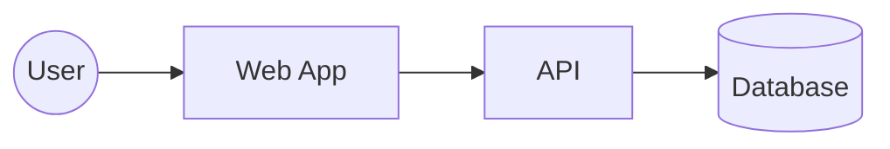

# C4 Model Reference

Purpose: Read this when the request is architectural and needs Context, Container, Component, or Code-level views.

## Contents

- C4 level selection
- Commands
- Scope rules
- Templates
- Clarification triggers

## Level Selection

| Level | Name | Use When | Default Audience |
|-------|------|----------|------------------|
| 1 | Context | You need system boundary and external actors | Product, leadership, onboarding |
| 2 | Container | You need deployable/runtime building blocks | Engineers, architects |
| 3 | Component | You need internals of one container | Engineers implementing or reviewing |
| 4 | Code | You need code-level structure for one component | Deep technical review only |

## Default Rule

- Stop at Level 1 or 2 unless the request clearly needs deeper detail.
- Use Level 3 for one container only.
- Use Level 4 only when the user explicitly needs code-level architecture.

## Commands

```text
/Canvas c4 context
/Canvas c4 container
/Canvas c4 component [container]
/Canvas c4 code [component]
/Canvas c4 all
/Canvas c4 zoom [element-name]
/Canvas c4 zoom out
```

## Mermaid Starter



## Color Hint

- External actor: neutral
- Primary system/container: blue
- Supporting service: teal
- Storage: gray
- Risk or external dependency: coral

### ON_C4_LEVEL

Ask when the user wants "architecture" but the audience is unclear:

- Context
- Container
- Component
- Code

### ON_C4_SCOPE

Ask when the system boundary is unclear:

- Whole system
- One service
- One container
- One component

### ON_C4_AUDIENCE

Ask when the same structure could be drawn differently for different readers:

- Leadership / product
- Engineering
- Operations
- Mixed audience
