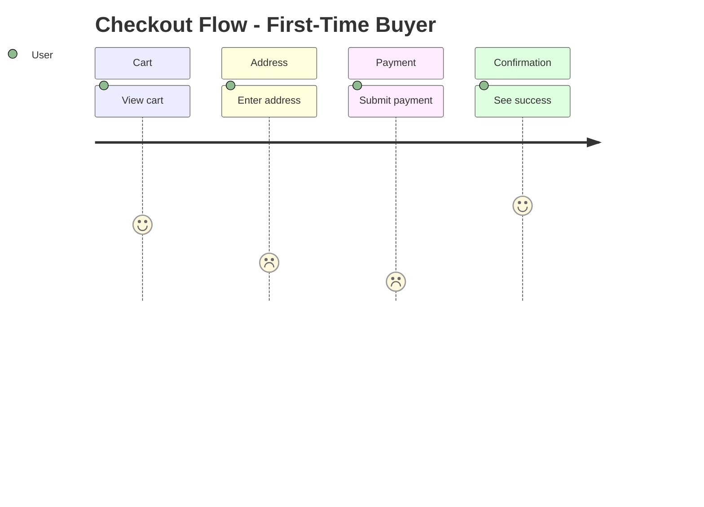
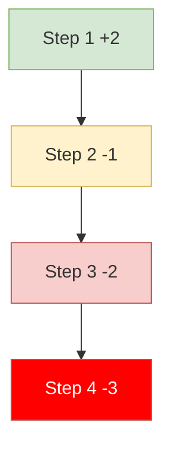
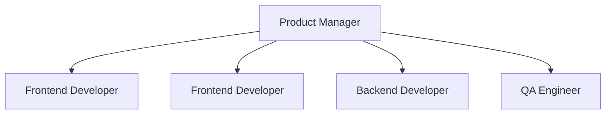

# Canvas Echo Integration Reference

Purpose: Read this when Echo provides journey, friction, persona, team, or DX data that must be turned into a visual artifact.

## Contents

- Visualization types
- Handoff schema
- Templates
- Score colors
- Output variants

## Visualization Types

| Echo Data | Canvas Output | Use When |
|-----------|---------------|----------|
| User Journey | Journey Map | Show step-by-step experience |
| Emotion Scores | Friction Heatmap | Highlight pain points |
| Cross-Persona Data | Comparison Matrix / Chart | Compare segments |
| Internal Persona | Profile Card | Visualize team members or stakeholders |
| Workflow Context | Workflow Diagram | Show process context |
| Team Structure | Organization Chart / Collaboration Map | Show roles and links |
| DX Journey | Developer Journey | Visualize engineering workflow pain |

## Standard Handoff Blocks

### Journey Data

```markdown
## Echo -> Canvas Journey Visualization

**Flow**: Checkout
**Persona**: First-Time Buyer
**Average Score**: -0.6

**Journey Data**:
| Step | Action | Score | Friction Type |
|------|--------|-------|---------------|
| 1 | Open cart | +2 | None |
| 2 | Enter address | -2 | Cognitive Overload |
| 3 | Submit payment | -3 | Error Handling |
```

### Cross-Persona Data

```markdown
## Echo -> Canvas Cross-Persona Visualization

**Flow**: Checkout
**Personas**: Newbie, Power, Mobile, Senior

**Comparison Matrix**:
| Step | Newbie | Power | Mobile | Senior | Issue Type |
|------|--------|-------|--------|--------|------------|
| 1 | +1 | +2 | +1 | +1 | Non-Issue |
| 2 | -2 | +1 | -2 | -3 | Segment |
```

### Internal Persona Data

```markdown
## Echo -> Canvas Internal Persona Visualization

**Persona Type**: Internal
**Category**: developer
**Role**: Frontend Developer
```

### Team Structure Data

```markdown
## Echo -> Canvas Team Structure Visualization

**Organization**: Product Team
**Scope**: Department
```

## Templates

### Journey Map



### Friction Heatmap



### Cross-Persona Chart

```mermaid
xychart-beta
    title "Cross-Persona Emotion Scores"
    x-axis [Step1, Step2, Step3]
    y-axis "Score" -3 --> 3
    line [2, -1, -3] "Newbie"
    line [3, 2, -2] "Power"
    line [2, -2, -3] "Mobile"
```

### Internal Persona Card

```text
+------------------------------+
| Frontend Developer           |
| Team: Platform               |
| Experience: 3-5 years        |
| Tools: VS Code, DevTools     |
+------------------------------+
```

### Team Structure



## Score Colors

| Score | Meaning | Color |
|-------|---------|-------|
| `+3`, `+2` | Strongly positive | Green |
| `+1`, `0` | Neutral / mild positive | Yellow |
| `-1` | Warning | Orange |
| `-2` | Negative | Red |
| `-3` | Critical friction | Dark red |

## Visual Journey From Navigator

## ECHO_TO_CANVAS_VISUAL_HANDOFF

```markdown
**Visualization Type**: Visual Journey Map | Friction Heatmap | Before/After
**Flow**: Signup
**Persona**: Skeptic
**Screenshots**:
- step1.png
- step2.png
**Key Friction**:
- Initial scan misses CTA
- Error feedback is too subtle
```

## Output Variants

- `## Canvas Journey Map`
- `## Canvas Internal Persona Profile`
- `## Canvas Team Structure`
- `## Canvas Visual Journey Map`

Use the variant that matches the visualization type exactly.
