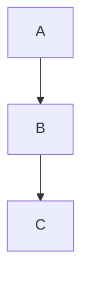
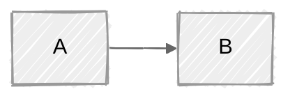
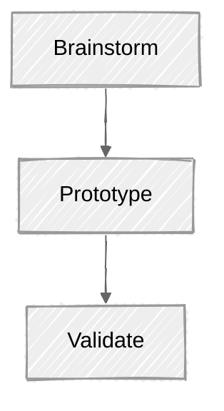
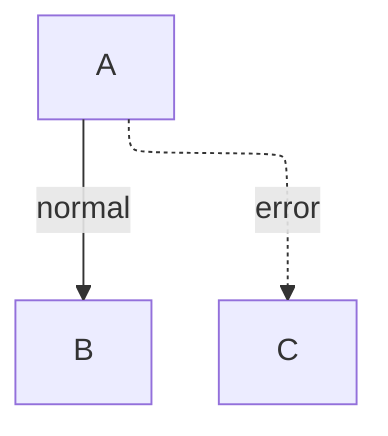

# Mermaid v11 Advanced Reference

Purpose: Read this when you need Mermaid v11-specific capabilities, advanced layout options, or renderer compatibility guidance.

## Contents

- Version-gated features
- Configuration rules
- ELK guidance
- Anti-patterns

## Version-Gated Features

| Feature | Minimum Version | Use When |
|---------|-----------------|----------|
| Architecture diagrams | `v11.1.0+` | You need service and infrastructure views |
| Kanban / Packet / Block / Radar | `v11+` | The user explicitly asks for newer Mermaid diagram families |
| Semantic shapes | `v11.3.0+` | You want richer shape vocabulary |
| Per-edge curves | `v11.10.0+` | One curve style per relationship matters |
| Radar diagrams | `v11+` | Multi-axis comparison (skills, coverage, scores) |
| Treemap diagrams | `v11+` | Hierarchical proportional area visualization |
| Hand-drawn look | `v11+` | Draft or whiteboard-style diagrams |

## Configuration Rule

- Prefer frontmatter config.
- Treat old `%%{init:}%%` directives as legacy and avoid them in new output.

## Frontmatter Config Examples

Theme override:

Flowchart layout tuning:

Combined settings:

## Hand-Drawn Look

Use `look: handDrawn` in frontmatter for draft, workshop, or whiteboard-style output.

Appropriate for: early design sessions, RFC drafts, ideation artifacts.
Not appropriate for: formal documentation, production runbooks, API specs.

## Per-Edge Curve Styles

Available since `v11.10.0+`. Override curve style per edge to distinguish flow types.

Supported values: `basis`, `bumpX`, `bumpY`, `cardinal`, `catmullRom`, `linear`, `monotoneX`, `monotoneY`, `natural`, `step`, `stepAfter`, `stepBefore`.

Use case: main flow with `basis` curves, exception/error paths with `step` curves for visual distinction.

Guideline: limit to 2 curve styles per diagram for readability.

## ELK Guidance

Use ELK when:

- The graph approaches `100+` nodes
- Layout overlap is severe
- The renderer supports ELK

## Anti-Patterns

- Do not assume Mermaid is a pixel-perfect layout tool.
- Do not use v11-only syntax against unknown renderers.
- Do not keep old init directives in newly generated diagrams.
- Do not use `look: handDrawn` for formal documentation, production runbooks, or API specs.
- Do not mix more than 2 per-edge curve styles in one diagram — visual noise outweighs clarity.
