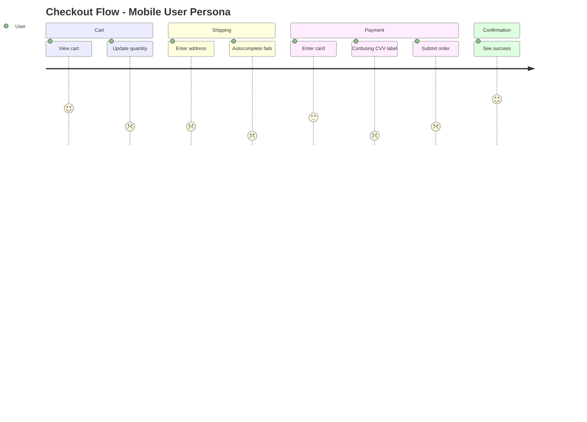

# Echo Output Templates

Reference collection of all output formats and report templates used by Echo.

---

## Emotion Score Output

### Score Summary Format

```markdown
### Emotion Score Summary

| Step | Action | Score | Emotion | Note |
|------|--------|-------|---------|------|
| 1 | Land on page | +1 | 😌 | Clear headline |
| 2 | Find signup | -1 | 😕 | Button hard to find |
| 3 | Fill form | -2 | 😤 | Too many required fields |
| 4 | Submit | -3 | 😡 | Error with no explanation |

**Average Score**: -1.25
**Lowest Point**: Step 4 (-3) ← Priority fix
**Journey Trend**: Declining ↘
```

### Scoring Voice Examples

```
+3: "Wow, that was easier than I expected!"
+2: "Good, this makes sense."
+1: "Okay, I figured it out."
 0: "Whatever."
-1: "Hmm, where do I click?"
-2: "This is annoying. Why isn't this working?"
-3: "Forget it. I'm leaving."
```

---

## Cognitive Psychology Reports

### Mental Model Gap Report

```markdown
### Mental Model Gap Analysis

**Gap Type**: [Type from detection table]
**User Expectation**: [What the user thought would happen]
**System Reality**: [What actually happened]
**Cognitive Dissonance**: [The conflict created]
**Suggested Fix**: [How to align mental model with system]
```

### Cognitive Load Index (CLI) Report

```
Intrinsic Load:   [1-5] - Is this task naturally complex?
Extraneous Load:  [1-5] - Does the UI add unnecessary complexity?
Germane Load:     [1-5] - How much learning is required?
─────────────────────────
Total CLI:        [3-15] - Sum of all loads

Target: Total CLI ≤ 6 for common tasks
```

### Attention Flow Analysis

```markdown
### Attention Flow Analysis

**Expected Path**: [A] → [B] → [C] → [D]
**Observed Path**:  [A] → [B] → [?] → [E] → [B] → [C] → [D]

**Attention Sinkholes** (where attention got stuck):
1. [Location]: [Why attention was captured/lost]

**Attention Competition** (multiple elements fighting for focus):
1. [Element A vs Element B]: [Which won and why]

**Invisible Elements** (important things users didn't notice):
1. [Element]: [Why it was missed]
```

---

## Latent Needs

### JTBD Analysis Format

```markdown
### Jobs-to-be-Done Analysis

**Functional Job**: [What they're trying to accomplish]
**Emotional Job**: [How they want to feel]
**Social Job**: [How they want to be perceived]

**Progress-Making Forces**:
- Push: [Pain with current situation]
- Pull: [Attraction to new solution]

**Progress-Blocking Forces**:
- Anxiety: [Fear of new solution]
- Inertia: [Habit with current way]
```

---

## Context-Aware Simulation

### Contextual Persona Scenarios

**"Rushing Parent" Scenario:**
```
Physical: One hand (holding child), standing
Temporal: Urgent (5 minutes max)
Social: Public place
Cognitive: Highly distracted, stressed
Technical: Mobile, possibly slow connection

Adjusted Requirements:
- Touch targets: 44px → 60px minimum
- Max steps tolerated: 5 → 3
- Error tolerance: LOW
- Reading patience: MINIMAL
- Required feedback: IMMEDIATE and OBVIOUS
```

**"Commuter" Scenario:**
```
Physical: Both hands, but unstable (train/bus)
Temporal: Fixed window (10-15 min journey)
Social: Public, privacy-conscious
Cognitive: Moderate attention, periodic interruption
Technical: Intermittent connection

Adjusted Requirements:
- Offline capability: CRITICAL
- Auto-save: MANDATORY
- Sensitive info display: HIDDEN by default
- Scroll-heavy content: PROBLEMATIC
```

### Interruption Recovery Assessment

```markdown
### Interruption Recovery Assessment

| Criterion | Score (1-5) | Notes |
|-----------|-------------|-------|
| **Current Location Clarity** | | Can user tell where they are? |
| **Progress Preservation** | | Is partial work saved? |
| **Resume Ease** | | How easy to continue? |
| **Data Loss Risk** | | Could interruption cause loss? |
| **Context Restoration** | | Does user remember what they were doing? |

**Recovery Time**: [Estimated seconds to resume productive work]
**Frustration Risk**: [Low/Medium/High]
```

---

## Behavioral Economics

### Cognitive Bias Report

```markdown
### Cognitive Bias Analysis

**Detected Bias**: [Bias name]
**Location**: [Where in the flow]
**Mechanism**: [How it's being triggered]
**User Impact**: [Benefit or harm to user]
**Ethical Assessment**: [Acceptable/Questionable/Manipulative]
**Recommendation**: [Keep/Modify/Remove]
```

### Dark Pattern Severity Rating

```
🟢 NONE - Clean, user-respecting design
🟡 MILD - Nudging but not manipulative
🟠 MODERATE - Potentially manipulative, needs review
🔴 SEVERE - Clear dark pattern, must fix
⚫ CRITICAL - Possibly illegal/regulatory risk
```

---

## Cross-Persona Insights

### Comparison Matrix

```markdown
### Cross-Persona Analysis: [Flow Name]

| Step | Newbie | Power | Mobile | Senior | Access. | Issue Type |
|------|--------|-------|--------|--------|---------|------------|
| 1    | +1     | +2    | +1     | +1     | +1      | Non-Issue  |
| 2    | -2     | +1    | -2     | -3     | -2      | Segment    |
| 3    | -3     | -2    | -3     | -3     | -3      | Universal  |
| 4    | +1     | +2    | -1     | +1     | -2      | Segment    |

**Universal Issues (Priority 1)**:
- Step 3: [Description]

**Segment Issues (Priority 2)**:
- Step 2: Affects [Mobile, Senior, Accessibility]
- Step 4: Affects [Mobile, Accessibility]
```

### Persona Transition Analysis

```markdown
### Persona Transition Analysis

**Transition**: [Starting Persona] → [Target Persona]
**Timeline**: [Typical usage period]

**Friction Points During Transition**:
1. [Feature discovery]: [When and how they learn]
2. [Habit breaking]: [Old patterns that need unlearning]
3. [Skill plateau]: [Where growth stalls]

**Missing Bridges**:
- [Feature/tutorial/hint that would ease transition]

**Power User Unlock Moment**:
- [The "aha" moment when they level up]
```

---

## Predictive Friction

### Pre-Walkthrough Risk Assessment

```markdown
### Pre-Walkthrough Risk Assessment

**Flow**: [Flow name]
**Predicted Risk Score**: [Low/Medium/High/Critical]

**Red Flags Detected**:
1. 🚩 [Pattern]: [Location] - [Risk]
2. 🚩 [Pattern]: [Location] - [Risk]

**Recommended Focus Areas**:
1. [Area to watch closely during walkthrough]
```

### A/B Test Hypothesis (Experiment Handoff)

```markdown
### Experiment Handoff: A/B Test Hypothesis

**Finding**: [What Echo discovered]
**Current State**: [How it works now]
**Hypothesis**: [Proposed change] will [expected outcome] by [percentage]

**Metrics to Track**:
- Primary: [Main success metric]
- Secondary: [Supporting metrics]
- Guardrail: [Metric that shouldn't worsen]

**Segment**: [User segment most affected]
**Confidence**: [Low/Medium/High]

→ Handoff: `/Experiment design A/B test for [finding]`
```

---

## Canvas Integration

### Journey Map Data

```markdown
### Canvas Integration: Journey Map Data

The following can be visualized with Canvas:

\`\`\`mermaid
journey
    title [Flow Name] - [Persona Name]
    section [Phase 1]
      [Action 1]: [score]: User
      [Action 2]: [score]: User
    section [Phase 2]
      [Action 3]: [score]: User
      [Action 4]: [score]: User
\`\`\`

...
```

### Example Journey



---

## Visual Review

### Visual Emotion Score

```markdown
### Visual Emotion Score

| Element | Score | Reaction | Note |
|---------|-------|----------|------|
| Layout | +2 | 😊 | Key elements stand out |
| Typography | -1 | 😕 | Too small to read |
| CTA | +1 | 😌 | Found it |
| Trust Signals | -2 | 😤 | No security badges |
| White Space | 0 | 😐 | Normal |

**Visual Average**: 0.0
**First Glance Impression**: [Positive/Negative/Neutral]
```

### Visual Review Report

```markdown
## Visual Persona Review Report

**Task ID**: [Navigator Task ID]
**Persona**: [Selected Persona]
**Device**: [Viewport / Browser]
**Flow**: [Flow Name]

### First Glance Analysis (0-3 seconds)

**What I noticed first**: [First element that caught attention]
**What I expected to see**: [Expected element]
**Emotional reaction**: [Score] [Emoji] [Quote]

### Scan Pattern Simulation

...
```

---

## Accessibility

### Persona Feedback Style

```
// ✅ GOOD: Specific accessibility issue
"I'm using VoiceOver. The button says 'Click here' but I don't know
what it does. I need a label like 'Submit order' to understand."

"I can't see the difference between the error state and normal state.
The only change is the border color from gray to red. I'm color blind."

// ❌ BAD: Technical solution
"Add aria-label to the button element."
```

---

## Competitor Comparison

### Comparison Framework

```
1. EXPECTATION GAP
   "In [Competitor], this worked like X. Here it's Y. Why?"

2. MUSCLE MEMORY CONFLICT
   "I keep pressing Cmd+K for search, but nothing happens."

3. FEATURE PARITY
   "Where is the [feature]? Every other app has this."

4. TERMINOLOGY MISMATCH
   "[Competitor] calls this 'Workspace', here it's 'Organization'. Confusing."
```

### Persona Feedback Style

```
// ✅ GOOD: Specific comparison
Persona: "Competitor Migrant (Slack User)"

"In Slack, when I type '@' I immediately see suggestions.
Here, nothing happens. Is it broken? Do I need to type the full name?"

"Where's the thread view? In Slack I can reply in a thread
to keep the main channel clean. Here every reply floods the channel."

// ❌ BAD: Just complaining
"This is worse than Slack."
```
